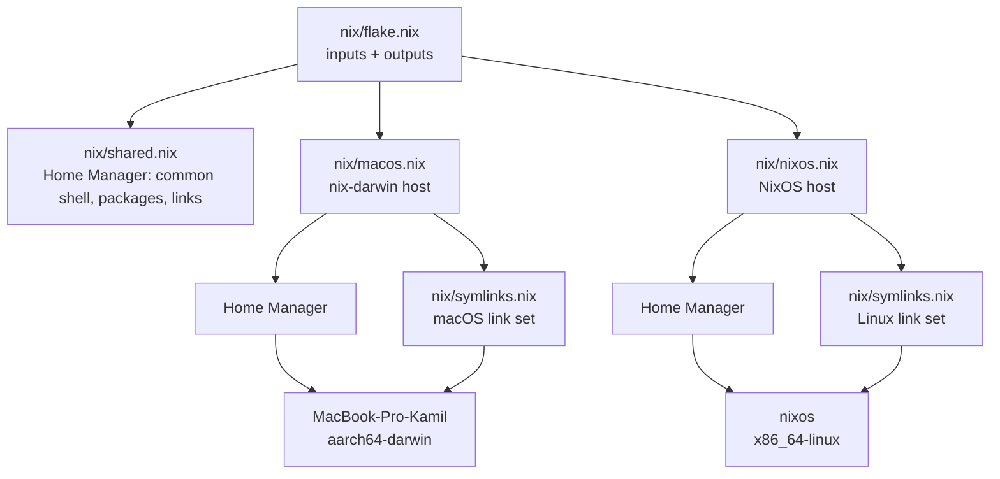
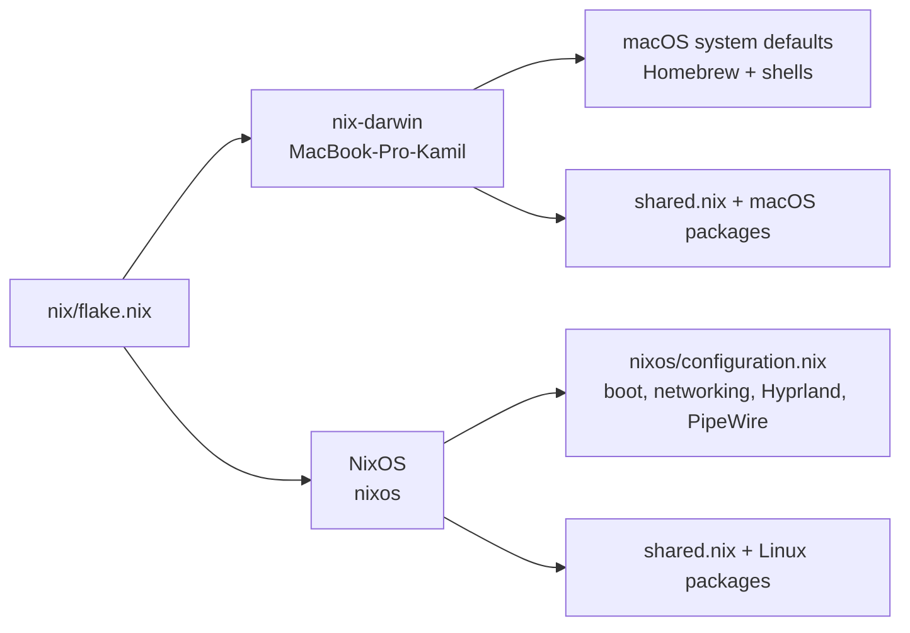
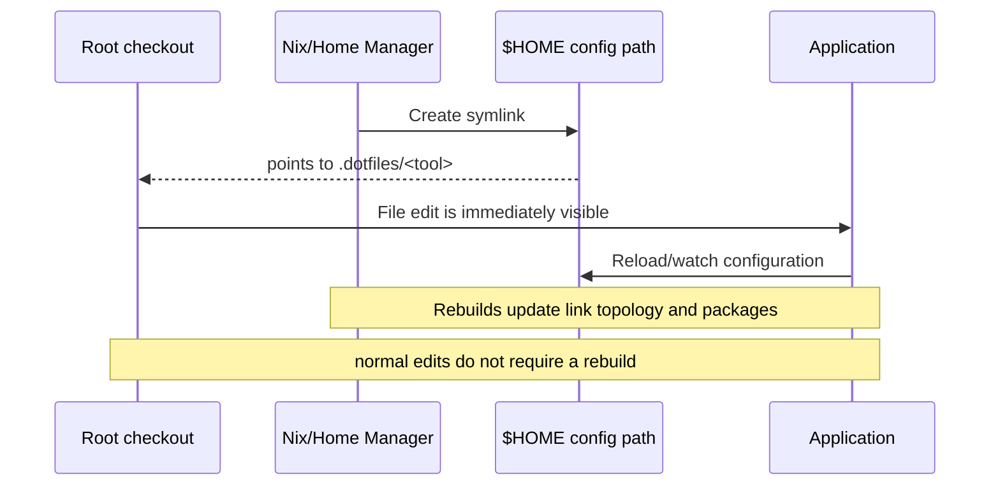

# .dotfiles

A single, live-editable configuration repository for my macOS and NixOS machines.

The repository keeps application configuration in the root directory (`nvim/`, `kitty/`, `wezterm/`, `hypr/`, and so on). Nix describes which programs are installed and where configuration links should exist; the links point back into this checkout instead of copying files into `$HOME`.

## Architecture

The top-level Nix flake is the composition root. It imports one system definition for each supported operating system and merges their outputs.



### Platform branches



- **`nix/flake.nix`** pins inputs and exposes the `darwinConfigurations` and `nixosConfigurations` outputs.
- **`nix/shared.nix`** is the common Home Manager layer: zsh, Starship, Git, common CLI tools, and links for shared applications.
- **`nix/macos.nix`** builds the `MacBook-Pro-Kamil` nix-darwin system, adds macOS packages, macOS defaults, Homebrew, and the Darwin-specific links.
- **`nix/nixos.nix`** builds the `nixos` system, adds Linux packages, fonts, cursor/GTK settings, systemd user services, and the Linux-specific links.
- **`nixos/configuration.nix`** contains machine-level NixOS settings such as boot, networking, graphics, audio, and Hyprland.
- **`nix/overlays/`** packages tools that need a local overlay (`opencode`, `codex`, and `pi`).

## How live configuration reload works

Nix owns the *topology* of the links. Git owns the mutable configuration contents. Home Manager uses out-of-store links, so editing a file in this repository edits the file the application is already reading.



The link policy lives in [`nix/symlinks.nix`](nix/symlinks.nix):

- `commonLinks` applies to both operating systems.
- `darwinLinks` adds macOS desktop/config paths such as SketchyBar, Aerospace, and Alacritty.
- `linuxLinks` adds Hyprland and Waybar.
- Activation refuses to overwrite a real, non-symlink target and fails if a source is missing.

Some files use Home Manager's `mkOutOfStoreSymlink` in [`nix/shared.nix`](nix/shared.nix), while the Darwin activation explicitly runs the link generator from `symlinks.nix`. NixOS also declares Linux-only links and files in its Home Manager module. This keeps links live while still allowing Nix to manage their locations.

## Repository layout

```text
.
├── nix/                 # Flake, system definitions, shared HM, overlays
├── nixos/               # NixOS machine configuration
├── nvim/ kitty/ ...     # Application configs at repository root
├── scripts/             # Helper scripts used by configs and workflows
├── docs/                # Setup and recovery notes
└── README.md
```

The important convention is: **a tool's configuration directory is a root-level sibling, not hidden below a second `config/` tree**. For example, edit `kitty/kitty.conf`, `herdr/config.toml`, or `nvim/init.lua`; the corresponding `$HOME/.config/...` path is linked to that directory.

## Tool and platform matrix

The package sets are intentionally split into common, macOS, and NixOS layers. “Equivalent” means the same role is covered by another program on the other platform; it does not imply identical behavior or configuration format.

### Shared on macOS and NixOS

| Role | Tool(s) | Configuration |
| --- | --- | --- |
| Shell and prompt | zsh, Starship, Atuin | [`zsh`](nix/shared.nix), [`starship/`](starship), [`atuin/`](atuin) |
| Editor and terminal workflow | Neovim, Kitty, herdr | [`nvim/`](nvim), [`kitty/`](kitty), [`herdr/`](herdr) |
| Files and text | ripgrep, fd, eza, bat, jq, yq, yazi, tree | mostly command-line defaults; [`bat/`](bat) |
| Git and review | Git, Git Extras, tig, lazygit, difftastic, hunk, lumen | [`lazygit/`](lazygit), [`hunk/`](hunk) |
| Agentic coding | oh-my-pi (`omp`) primary; OpenCode fallback | [`pi/`](pi), [`opencode/`](opencode) |
| Databases | SQLite, Harlequin, Rainfrog | [`hunk/`](hunk) and shell configuration |
| Networking and transfer | curl, wget, OpenSSH, rsync, socat, WireGuard | shell configuration |
| Terminal UI and utilities | btop, htop, fastfetch, superfile, lazydocker, tldr | [`btop/`](btop), [`superfile/`](superfile) |
| Terminal/workflow CLIs | herdr, worktrunk, lazyjira | [`herdr/`](herdr), [`worktrunk/`](worktrunk) |
| Browser tooling | qutebrowser (available fallback) | [`qutebrowser/`](qutebrowser) |

For agentic work, **oh-my-pi (`omp`) is the primary harness** and **OpenCode is the fallback**. No other agentic harnesses are part of the intended workflow; their presence in the repository should not be interpreted as active tooling.

### macOS-specific

| Role | Tool(s) | Linux/NixOS counterpart |
| --- | --- | --- |
| System integration | nix-darwin | NixOS modules (`nix/nixos.nix`, `nixos/configuration.nix`) |
| Window manager / compositor | Aerospace | Hyprland |
| Status bar | SketchyBar | Waybar |
| Terminal apps | Kitty, WezTerm, Ghostty, Alacritty | Alacritty, Kitty, WezTerm (shared where enabled) |
| Virtualization | Lima, Colima, QEMU, UTM | QEMU, Podman, Docker |
| GUI application delivery | Homebrew brews and casks | Nix packages and NixOS modules |
| macOS automation | Hammerspoon | Hyprland scripts / systemd user services |
| Desktop applications | Chromium, Firefox, Vivaldi, Signal, Obsidian, Postman, Raycast | Chromium, Firefox, Signal, Obsidian, qutebrowser (package availability differs) |

The primary macOS browser is **Helium**. The Chromium, Firefox, Vivaldi, and qutebrowser configurations are retained as fallback/returning-browser setups, not as the daily browser workflow.

macOS Homebrew is used for GUI applications and tools that are unavailable or inconvenient in the current Nix package set. The authoritative list is in [`nix/macos.nix`](nix/macos.nix).

### NixOS-specific

| Role | Tool(s) | macOS counterpart |
| --- | --- | --- |
| Desktop compositor | Hyprland | Aerospace |
| Status bar and launcher | Waybar, Walker, Elephant | SketchyBar, Raycast |
| Lock screen and idle desktop | Hyprlock, Hypridle | macOS screen lock / system behavior |
| Audio and graphics | PipeWire, Pulse compatibility, XWayland | CoreAudio and native macOS display stack |
| Wi-Fi/Bluetooth TUIs | impala, bluetuith | macOS system UI or third-party GUI tools |
| Container stack | Docker, Podman, Compose, buildx | Docker/Podman plus Colima/Lima |
| Linux development | gcc, nixd, nightly Rust, Zig, PHP, Go | clang/Xcode toolchain, rustup, same language tools |
| Screenshot and clipboard | flameshot, swappy, wl-clipboard | macOS screenshot and clipboard tools |
| Keyboard remapping | kmonad | macOS keyboard shortcuts / QMK Toolbox |
| Linux fonts/cursors | JetBrains Mono, Lexend, Capitaine cursors | Nerd fonts and macOS font management |

## Applying the configurations

From the repository root:

```sh
# macOS
sudo darwin-rebuild switch --flake ./nix # or `nrs` alias

# NixOS
sudo nixos-rebuild switch --flake ./nix # or `nrs` alias
```

The shared zsh aliases expose these as `nrs`; each platform overrides it with the correct rebuild command. A rebuild installs or updates packages and recreates the declared symlink topology. Editing a linked root-level configuration afterward should normally be picked up by the application without another rebuild.

## Adding a new configuration

1. Create a root-level directory or file named after the application.
2. Add the desired `$HOME` target to the appropriate set in [`nix/symlinks.nix`](nix/symlinks.nix), or add a Home Manager `home.file` entry when the target needs a special path.
3. Use `commonLinks` for both platforms; use `darwinLinks` or `linuxLinks` when the application is platform-specific.
4. Rebuild once to create the link, then edit the root-level source directly.

Keep generated state, caches, and machine-specific secrets out of the repository unless the relevant application deliberately requires them.
