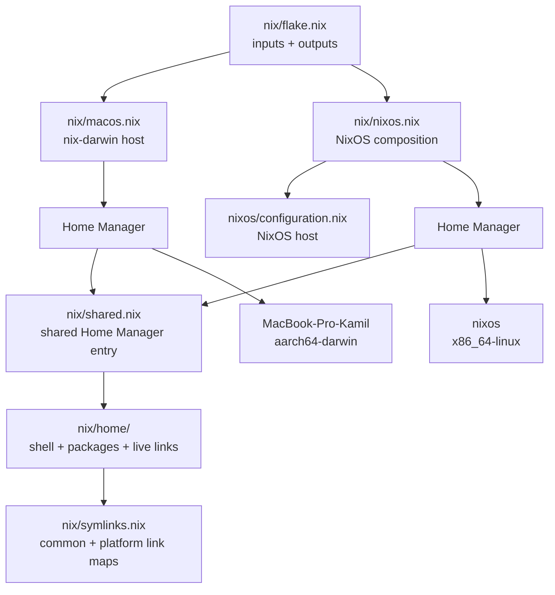
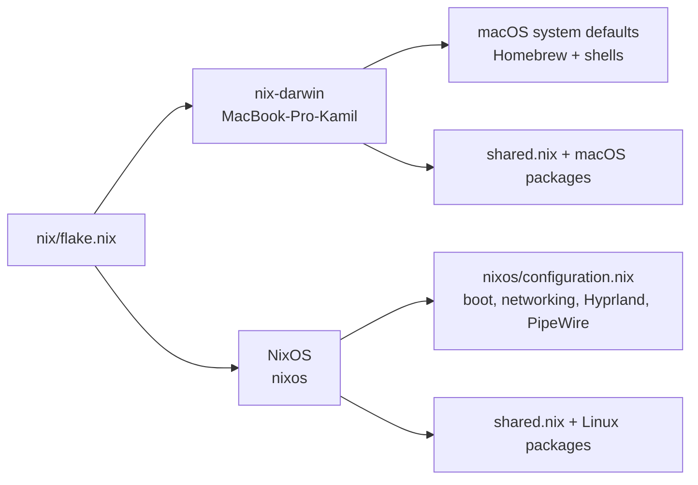
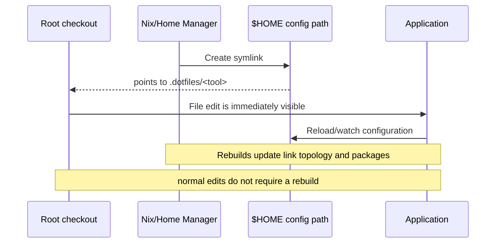

# .dotfiles

A single, live-editable configuration repository for my macOS and NixOS machines.

The repository keeps application configuration in the root directory (`nvim/`, `kitty/`, `wezterm/`, `hypr/`, and so on). Nix describes which programs are installed and where configuration links should exist; the links point back into this checkout instead of copying files into `$HOME`.

## Architecture

The top-level Nix flake is the composition root. It imports one system definition for each supported operating system and merges their outputs.



### Platform branches



- **`nix/flake.nix`** pins inputs and exposes the `darwinConfigurations` and `nixosConfigurations` outputs.
- **`nix/shared.nix`** imports the common Home Manager modules in `nix/home/`.
- **`nix/home/`** contains shared shell, package, and live-link modules.
- **`nix/macos.nix`** builds the `MacBook-Pro-Kamil` nix-darwin system, bootstraps Homebrew through nix-homebrew, and adds macOS packages, defaults, and shell helpers.
- **`nix/nixos.nix`** composes the `nixos` host with Home Manager, Linux-specific user settings, and sops-nix.
- **`nixos/configuration.nix`** contains machine-level NixOS settings such as boot, networking, firmware updates, power/thermal management, graphics, audio, and Hyprland.
- **`nix/overlays/`** packages tools that need a local overlay (`opencode` and `omp`).
- **`nix-index-database`** supplies `nix-locate` and `comma` on both platforms; **sops-nix** is imported for future encrypted secrets, but no secrets or recipients are declared yet.

## How live configuration reload works

Nix owns the *topology* of the links. Git owns the mutable configuration contents. Home Manager uses out-of-store links, so editing a file in this repository edits the file the application is already reading.



The link policy lives in [`nix/symlinks.nix`](nix/symlinks.nix):

- `commonLinks` applies to both operating systems.
- `darwinLinks` adds macOS-only paths such as SketchyBar, Aerospace, Hammerspoon, and cmux.
- `linuxLinks` adds Hyprland, Waybar, Walker, Omarchy, and other Linux desktop paths.
- Home Manager creates every repository link with `mkOutOfStoreSymlink`.
- Activation adopts only legacy symlinks already pointing into this checkout. Missing sources, real targets, and unrelated symlinks abort without overwriting them.

Editing linked files remains immediate and requires no rebuild. Rebuild only after changing packages or link topology.

## Repository layout

```text
.
├── nix/                 # Flake, system definitions, shared HM, overlays
├── nixos/               # NixOS machine configuration
├── nvim/ kitty/ ...     # Application configs at repository root
├── scripts/             # Helper scripts used by configs and workflows
├── docs/                # Setup and recovery notes
└── README.md
```

The important convention is: **a tool's configuration directory is a root-level sibling, not hidden below a second `config/` tree**. For example, edit `kitty/kitty.conf`, `herdr/config.toml`, or `nvim/init.lua`; the corresponding `$HOME/.config/...` path is linked to that directory.

## Tool and platform matrix

The package sets are intentionally split into common, macOS, and NixOS layers. “Equivalent” means the same role is covered by another program on the other platform; it does not imply identical behavior or configuration format.

### Shared on macOS and NixOS

| Role | Tool(s) | Configuration |
| --- | --- | --- |
| Shell and prompt | zsh, Starship, Atuin | [`zsh`](nix/shared.nix), [`starship/`](starship), [`atuin/`](atuin) |
| Editor and terminal workflow | Neovim, Kitty, herdr | [`nvim/`](nvim), [`kitty/`](kitty), [`herdr/`](herdr) |
| Files and text | ripgrep, fd, eza, bat, jq, yq, yazi, tree | mostly command-line defaults; [`bat/`](bat) |
| Git and review | Git, Git Extras, tig, lazygit, difftastic, hunk, lumen | [`lazygit/`](lazygit), [`hunk/`](hunk) |
| Agentic coding | oh-my-pi (`omp`) primary; OpenCode fallback | [`pi/`](pi), [`opencode/`](opencode) |
| SQL workflow | vim-dadbod, vim-dadbod-ui, vim-dadbod-completion in Neovim | [`nvim/init.lua`](nvim/init.lua) |
| Networking and transfer | curl, wget, OpenSSH, rsync, socat, WireGuard | shell configuration |
| Terminal UI and utilities | btop, htop, fastfetch, superfile, lazydocker, tldr | [`btop/`](btop), [`superfile/`](superfile) |
| Terminal/workflow CLIs | herdr, worktrunk, lazyjira | [`herdr/`](herdr), [`worktrunk/`](worktrunk) |
| Browser tooling | qutebrowser (available fallback) | Nix package; no repository-specific configuration |
| Nix package discovery | nix-index, comma | Weekly prebuilt nix-index database |

SQL work is intentionally handled inside Neovim with the Dadbod plugins. Harlequin and Rainfrog were tried and removed from the package sets.

For agentic work, **oh-my-pi (`omp`) is the primary harness** and **OpenCode is the fallback**. No other agentic harness is installed by this flake.

### macOS-specific

| Role | Tool(s) | Linux/NixOS counterpart |
| --- | --- | --- |
| System integration | nix-darwin | NixOS modules (`nix/nixos.nix`, `nixos/configuration.nix`) |
| Window manager / compositor | Aerospace | Hyprland |
| Status bar | SketchyBar | Waybar |
| Terminal apps | Kitty, WezTerm, Ghostty, Alacritty | Alacritty, Kitty, WezTerm (shared where enabled) |
| Virtualization | Lima, Colima, QEMU, UTM | QEMU, Podman, Docker |
| GUI application delivery | Homebrew brews and casks | Nix packages and NixOS modules |
| macOS automation | Hammerspoon | Hyprland scripts / systemd user services |
| Desktop applications | Chromium, Firefox, Vivaldi, Signal, Obsidian, Postman, Raycast | Chromium, Firefox, Signal, Obsidian, qutebrowser (package availability differs) |

The primary macOS browser is **Helium**, installed outside this flake. Chromium, Firefox, Vivaldi, and qutebrowser remain declaratively installed fallbacks.

macOS Homebrew is used for GUI applications and tools that are unavailable or inconvenient in the current Nix package set. The authoritative list is in [`nix/macos.nix`](nix/macos.nix).

### NixOS-specific

| Role | Tool(s) | macOS counterpart |
| --- | --- | --- |
| Desktop compositor | Hyprland | Aerospace |
| Status bar and launcher | Waybar, Walker, Elephant | SketchyBar, Raycast |
| Lock screen and idle desktop | Hyprlock, Hypridle | macOS screen lock / system behavior |
| Audio and graphics | PipeWire, Pulse compatibility, XWayland | CoreAudio and native macOS display stack |
| Wi-Fi/Bluetooth TUIs | impala, bluetuith | macOS system UI or third-party GUI tools |
| Container stack | Docker, Podman, Compose, buildx | Docker/Podman plus Colima/Lima |
| Linux development | gcc, nixd, nightly Rust, Zig, PHP, Go | clang/Xcode toolchain, rustup, same language tools |
| Screenshot and clipboard | flameshot, swappy, wl-clipboard | macOS screenshot and clipboard tools |
| Keyboard remapping | kmonad | macOS keyboard shortcuts / QMK Toolbox |
| Linux fonts/cursors | JetBrains Mono, Lexend, Capitaine cursors | Nerd fonts and macOS font management |
| Laptop firmware and power | fwupd, thermald, power-profiles-daemon | Vendor firmware tools and macOS power management |

## Installing NixOS from scratch

The NixOS host supports a mostly one-command bare-metal installation through
[Disko](https://github.com/nix-community/disko) and
[nixos-anywhere](https://github.com/nix-community/nixos-anywhere). The only
manual choices left are the target over SSH, the disk to erase, and the two
passwords that must not be committed.

The declared layout in [`nixos/disk-config.nix`](nixos/disk-config.nix) creates:

- a 1 GiB UEFI system partition mounted at `/boot`;
- a LUKS2-encrypted partition using the remaining space;
- an ext4 root filesystem inside LUKS.

### 1. Boot the target laptop

Boot the official NixOS installer, connect it to the network, and run:

```sh
sudo passwd nixos
ip -brief address
ls -l /dev/disk/by-id/
```

The temporary `nixos` password only grants the installer SSH access. Prefer the
stable whole-disk path under `/dev/disk/by-id/`; do not select a partition path.

### 2. Run the installer from this checkout

Commit the configuration you want to install, then run from macOS or Linux:

```sh
./scripts/install-nixos-anywhere.sh \
  --target nixos@192.168.1.50 \
  --disk /dev/disk/by-id/nvme-YOUR_DRIVE
```

The script shows the exact disk and requires typing it back before anything is
destroyed. It then prompts locally for:

1. the LUKS passphrase used at boot;
2. the `kamil` login password.

Plaintext passwords are held only in temporary mode-0600 files and removed when
the command exits. The login password is stored on the target as a yescrypt
hash. The first available local public key (`id_ed25519.pub`, `id_ecdsa.pub`, or
`id_rsa.pub`) is authorized for `kamil`; override it with `--public-key PATH`.

The installation:

1. stages committed `HEAD`, excluding ignored files and untracked secrets;
2. persists that checkout as `/home/kamil/.dotfiles` with UID/GID 1000;
3. replaces [`nixos/install-disk`](nixos/install-disk) in the staged checkout;
4. generates target hardware settings with `--no-filesystems`, leaving Disko
   as the single owner of partitions and mounts;
5. partitions, formats, installs, and reboots through nixos-anywhere.

Preview argument validation and the generated command without connecting to or
changing a target:

```sh
./scripts/install-nixos-anywhere.sh \
  --target nixos@192.168.1.50 \
  --disk /dev/nvme0n1 \
  --dry-run
```

`--yes` skips only the disk-name confirmation; password prompts remain. Use
`--identity PATH` when the installer requires a specific SSH private key.

After the first login, inspect and commit the generated
`nixos/hardware-configuration.nix`, `nixos/install-disk`, and
`nixos/bootstrap.nix` changes if this machine should become the repository's
canonical NixOS host.

### Bootable USB workflow

The custom USB image embeds committed `HEAD` and a passphrase-encrypted private
home-directory payload. Create a staging directory whose contents should become
`/home/kamil`; symlinks and special files are rejected:

```sh
mkdir -p ~/installer-private/.ssh ~/installer-private/.local/share/fonts
cp ~/.ssh/id_ed25519{,.pub} ~/installer-private/.ssh/
cp -R ~/.local/share/fonts/PAID-FONT ~/installer-private/.local/share/fonts/
./scripts/create-installer-vault.sh \
  --source ~/installer-private \
  --output ~/nixos-installer-vault.age
```

Build the ISO from a clean, committed checkout:

```sh
./scripts/build-nixos-installer.sh \
  --vault ~/nixos-installer-vault.age \
  --out-link result-installer
```

The image is under `result-installer/iso/`. Building an x86_64 NixOS ISO
requires an x86_64-linux builder; an aarch64-darwin machine needs a configured
Linux remote/VM builder.

After boot, the installer starts on tty1, checks network access, offers `nmtui`
when necessary, asks which fixed disk to erase, and retains the exact disk-name
confirmation. It then prompts for the vault, LUKS, and login passphrases before
installing and rebooting. The current image is **online**: the repository and
encrypted vault are embedded, but target package closures are downloaded from
the configured Nix caches.

The decrypted vault archive exists only below `/run` in the live installer.
Archive paths and member types are validated before extraction; SSH directories
are installed as mode 0700, private files as 0600, and public keys as 0644.

> **Destructive boundary:** Disko erases the entire value passed to `--disk`.
> Target/disk selection cannot safely be inferred when more than one drive is
> present, so the installer deliberately requires both.

## Applying the configurations
On macOS, nix-homebrew installs or adopts the Apple Silicon Homebrew prefix before nix-darwin applies the declared formulae, casks, and taps.

From the repository root:

```sh
# macOS
nh darwin switch ./nix # or `nrs` alias

# NixOS
nh os switch ./nix # or `nrs` alias
```

For the first rebuild on a machine where `nh` is not installed yet, bootstrap with the native command:

```sh
# macOS
sudo darwin-rebuild switch --flake ./nix

# NixOS
sudo nixos-rebuild switch --flake ./nix
```

Each platform uses the matching `nh` rebuild command: `nh darwin switch` on macOS and `nh os switch` on NixOS. A rebuild installs or updates packages and recreates the declared symlink topology. Editing a linked root-level configuration afterward is immediately visible without another rebuild.

## Adding a new configuration

1. Create a root-level directory or file named after the application.
2. Add the desired `$HOME` target to the appropriate set in [`nix/symlinks.nix`](nix/symlinks.nix). Reserve direct `home.file` declarations for Nix-store-owned files rather than repository dotfiles.
3. Use `commonLinks` for both platforms; use `darwinLinks` or `linuxLinks` when the application is platform-specific.
4. Rebuild once to create the link, then edit the root-level source directly.

Keep generated state, caches, and machine-specific secrets out of the repository unless the relevant application deliberately requires them.
