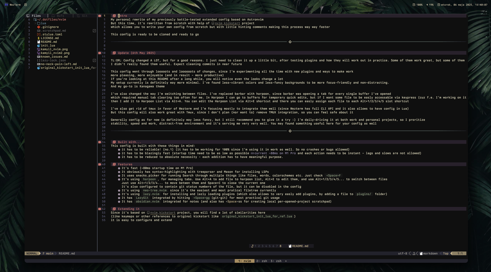
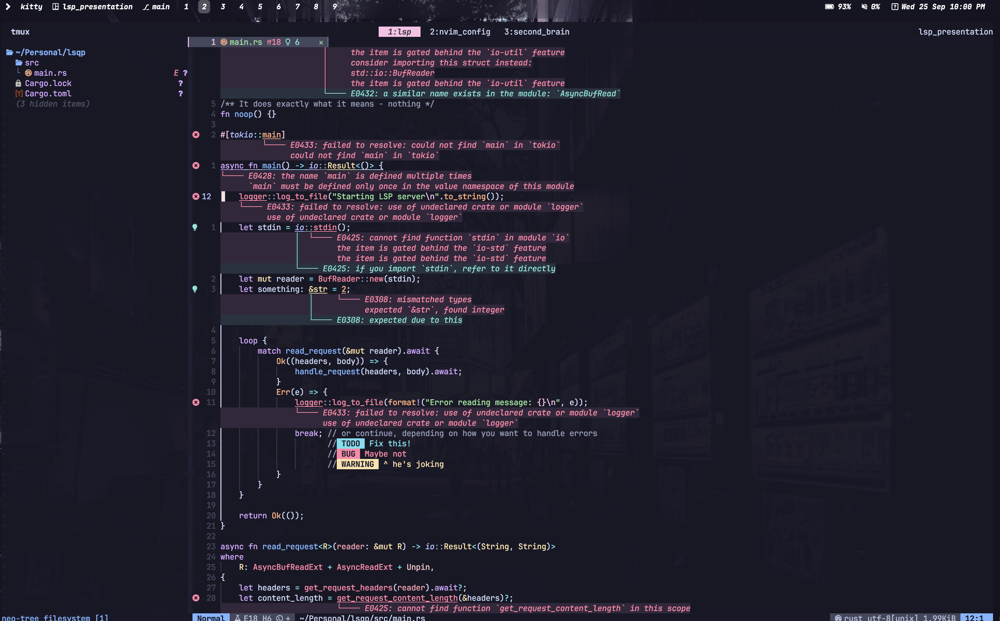

# Intro
My personal rewrite of my previously battle-tested extended config based on Astronvim
But this time, it's rewritten from scratch with help of [nvim_kickstart](https://github.com/nvim-lua/kickstart.nvim) project
which allows you to write your own config from scratch but with little hinting comments making this process way way faster

This config is ready to be cloned and ready to go 

# Built with... 
This config is built with these things in mind:
- it has to be **reliable! (no.1)** (it has to be working for 100% since I'm using it in work as well. So no crashes or bugs allowed)
- it has to be **blazingly fast** (startup time need to be as low as possible [current ~80ms on M1 Pro] and each action needs to be instant - lags and slows are not allowed) 
- it has to be **reduced to absolute necessity** - each addition has to have meaningful purpose. There is even a file in `lua/plugins/reason_per_plugin.md` file containing the reasoning behind the given plugin
- it has to be **practical and easy-to-use** - it has to contain very simple and practical functionalities that helps you do things, mental overhead is not allowed here
... and lastly
- it should be *beautiful*, but it can't compromise these 4 ^. These 4 comes first **ALWAYS**, then we can kinda experiment with the looks to make it enjoybale to **use** and look at.
Work has to give nice vibes in order to make it a please, but it can't sacrifice the reliability :)

# Features
- It's fast (~80ms startup time on M1 Pro)
- It obviously has syntax-highlighting with treeparser and Mason for installing LSPs
- It obviously has telescope for running Search through multiple things. Just check `<Space>S`
- It's using `barbar.nvim`, to have practical tabs at top, which I found it most easy and straight-forward to use. 
  Just use Space+1/2/3/4... to move betwen them and Space+C to close the current one
  It's also configured to contain git status numbers of the file, but it can be disabled in the config
- It's using `neo-tree.nvim` since it's the easiest and most pratical filetree currently
- It's using `lazy.nvim` for installing and lazly loading plugins (which also allows to very easly add plugins, by adding a file to `plugins/` folder)
- It has `LazyGit` integrated by hitting `<Space>gg`(git-git) for most practical git usage
- It has `obsidian.nvim` integrated for notes (and also has <Space>ss for creating scratchpad) 

# Extending it
Since it's based on [nvim_kickstart](https://github.com/nvim-lua/kickstart.nvim) project, you will find a lot of similarities here
(like keymaps or other references to original kickstart like `original_kickstart_init_lua_for_ref.lua`) 
it is easy to configure and extend
